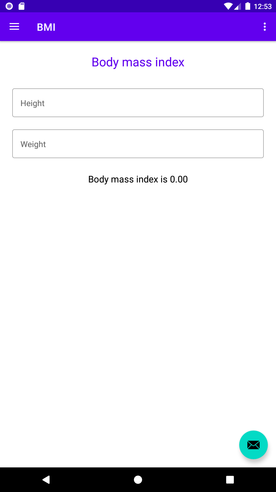
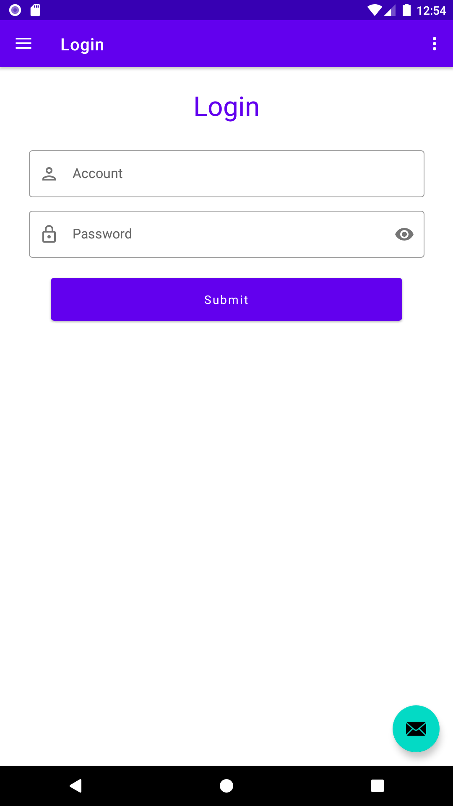
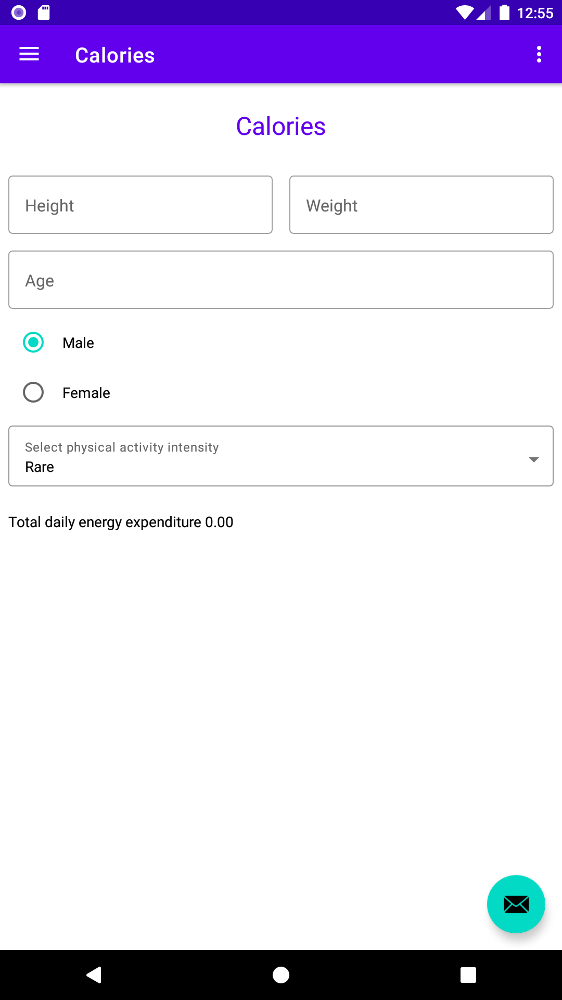

# Kotlin walk through

A learning diary of kotlin android development.

## Description

Bmi calculator

Login form

Calories calculator

## Question & Answer

### No Android SDK?
Just download it, and setup environment variable `ANDROID_HOME=\\PATH_TO_SDK`
